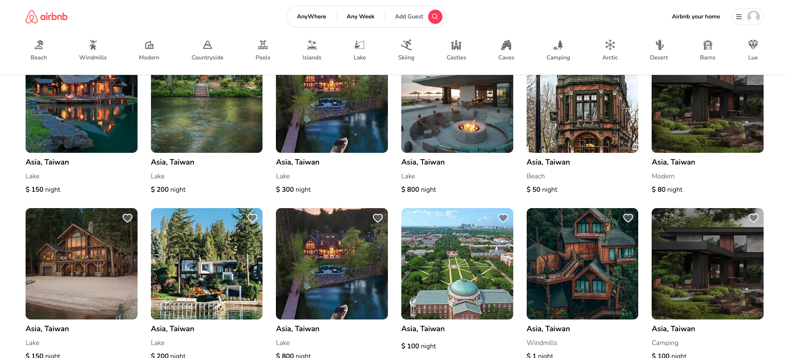

# Airbnb Clone

## [Demo Website](https://pethelp-api.store/)

這是一個使用 Next13、Leaflet、NextAuth、react-date-range 和 date-fns 等技術構建的 Airbnb Clone 專案。

 
 

## 技術特點

專案：

- 使用 Next13，設計 ServerComponent 與 ClientComponent 之間溝通，並透過 Server API route 跟後端交互資料。
- 狀態管理使用 Redux RTK。
- DockerFile 打包至 DockerHub

使用者身份：

- 使用者身份驗證：透過 NextAuth 進行一般登入及 google 身份驗證，在 Server 與後端交換所需 Token 及使用者資料，轉交給 NextAuth 進行 Cookie-based session using JSON Web Encryption。

地圖：

- 使用 Leaflet 串接地圖資訊，節省直接使用 gcp 串接 Google Map API 產生之點擊費用。

時間：

- react-date-range 和 date-fns 處理時間格式轉換及時間選擇器。

Cache：

- Next13 提供 Data Fetching, Caching, and Revalidating
- Image 使用 GCP Cache static content

 
 

## 功能特點

帳號系統：

- 登入系統：可透過 一般帳號密碼 / Google 註冊及登入。
- 訂房系統：搜尋房源後可輸入指定日期訂房。
- 房源搜索：可以根據時間、地點等條件進行房源搜索。
- 行程管理：使用者可以預約房間並查看自己的行程。
- 收藏清單：使用者可以將房源添加到最愛清單並在清單中查看。
- 房源上傳：房東可以上傳房源供使用者訂房，並在清單中查看。

 
 

## 示例帳號

使用以下示例帳號進行測試：

一般登入：

    帳號：testaccount@gmail.com
    密碼：Test1234

(上述帳號密碼皆有在 placeholder 中提供)

Google 登入：

    直接使用 Google 帳戶登入
